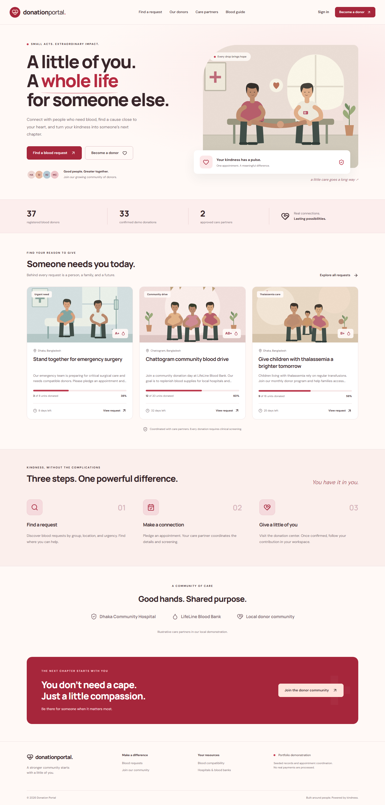
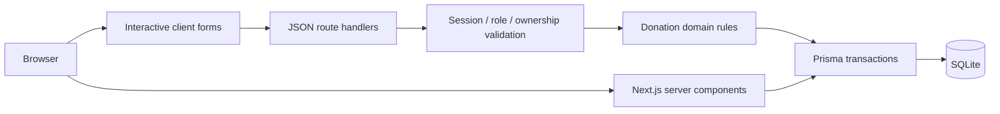
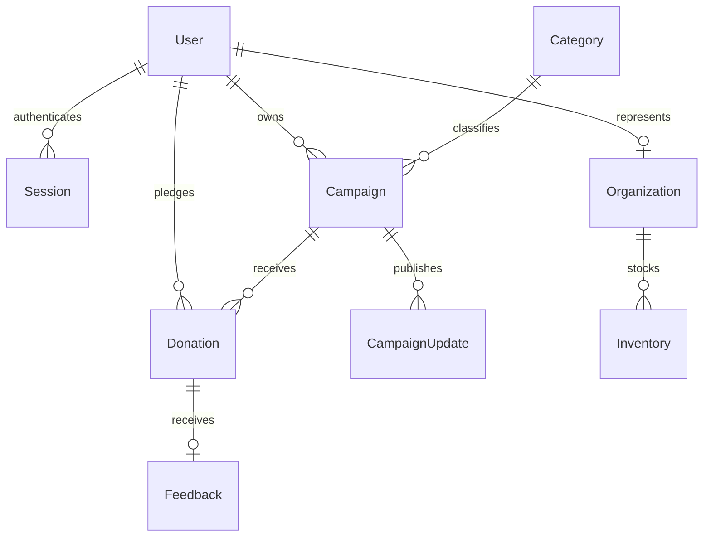
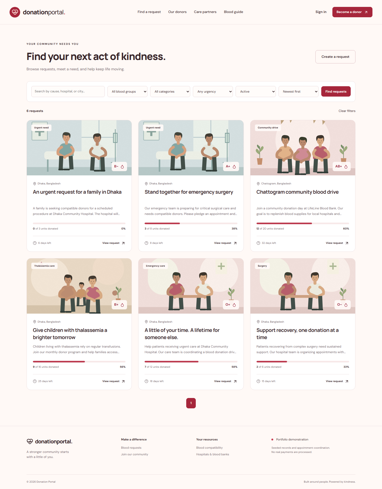
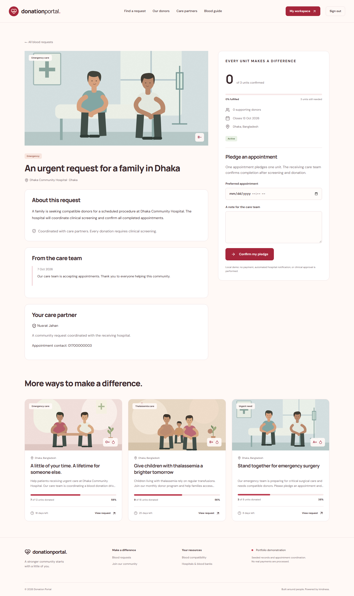
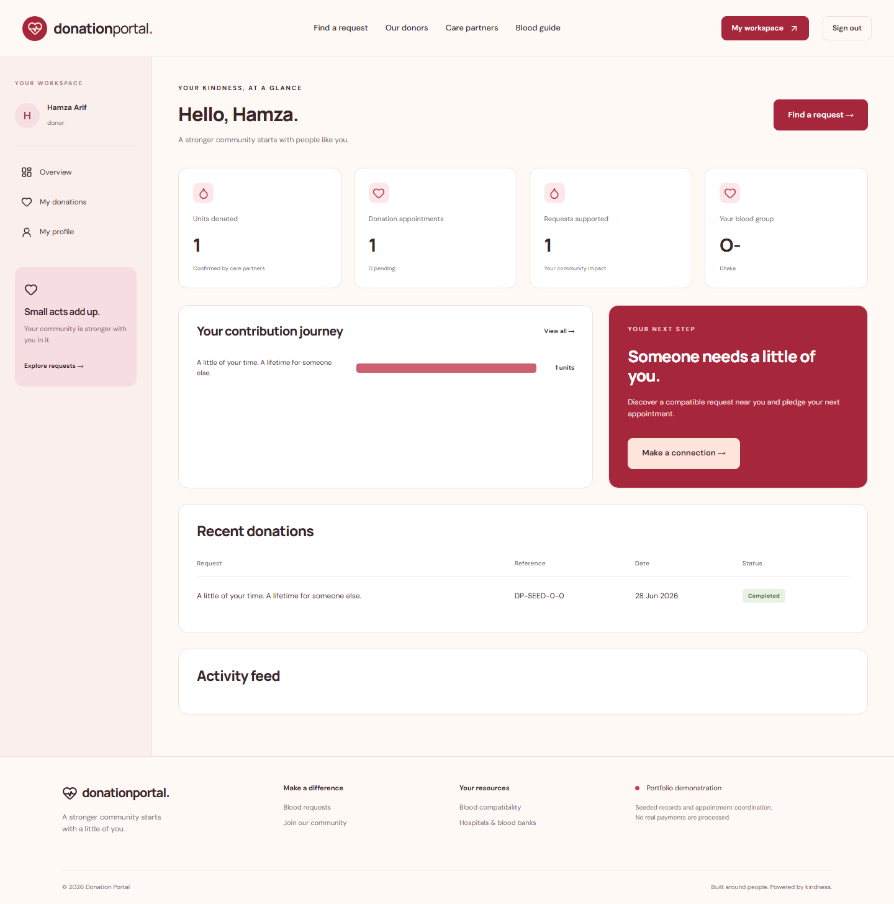
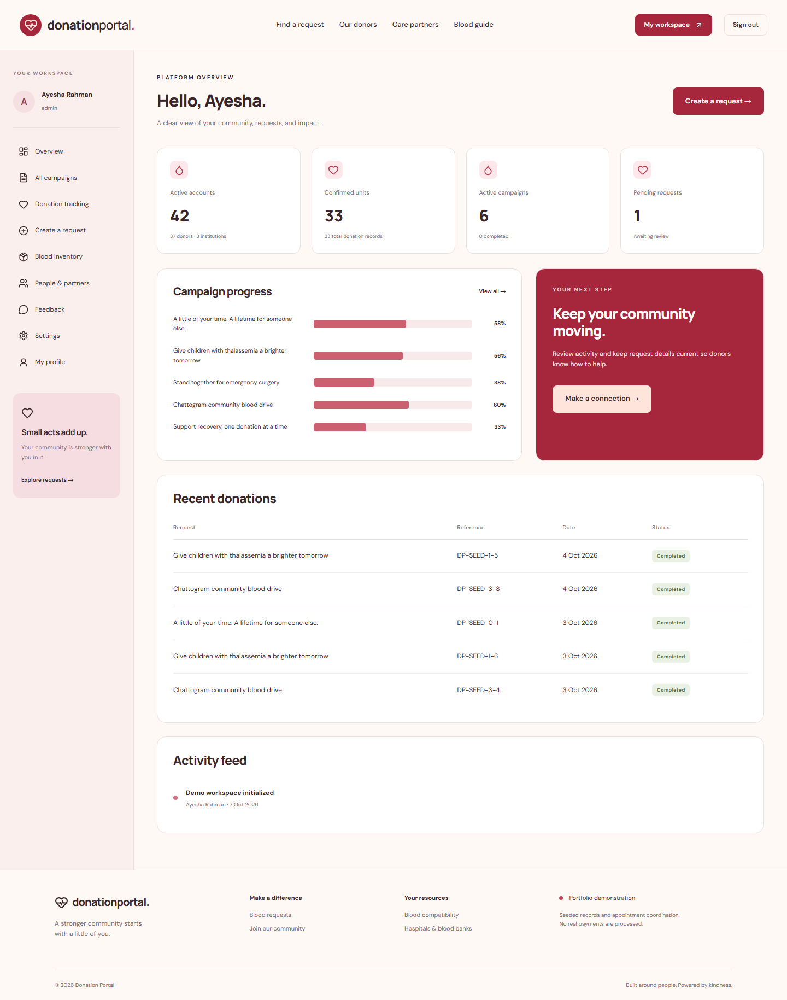

# Donation Portal

**Give blood. Keep life moving.**

A full-stack blood donation coordination platform connecting donors, patients, hospitals, and blood banks across Bangladesh. Discover a compatible request, pledge an appointment, and follow its confirmation through a protected workspace.



## Overview

Donation Portal makes blood requests easier to discover and coordinate. Care partners publish reviewed campaigns, donors pledge one-unit appointments, and the receiving institution confirms completed donations. Confirmed units drive campaign progress; pending, failed, and cancelled appointments remain traceable.

This repository is a **local portfolio demonstration** with illustrative organizations and seeded records. It does not process money, send real hospital notifications, or provide clinical clearance. No payment gateway is implied.

## Key features

- Responsive public site with original SVG illustrations, request cards, clear onboarding, and care partner directory.
- Account registration, scrypt password hashing, opaque session cookies, logout, persistent rate limiting, and server-side authorization.
- Five roles: donor, patient, hospital, blood bank, and administrator.
- Blood request creation/editing, emergency urgency, institution approvals, campaign moderation, and care team updates.
- Search by request/hospital/city, blood group/category/status/urgency filters, sorting, and pagination.
- Screening profiles, eight-group red-cell compatibility checker, and privacy-conscious donor discovery.
- Appointment pledging, unique references, confirmation/failure/cancellation, capacity checks, and guarded transitions.
- Donor history and CSV export, institution dashboards, admin analytics, audit feed, and feedback moderation.
- Blood inventory batches with expiry dates and guarded stock issuance.
- Categories, configurable donation interval, account deactivation, loading/empty/error/success states.
- Tracked migrations, realistic local seed data, isolated integration tests, and reproducible screenshots.

## User roles

| Role                | Workspace capabilities                                                                                                                                |
| ------------------- | ----------------------------------------------------------------------------------------------------------------------------------------------------- |
| Visitor             | Browse/search requests, inspect details, compatibility guide, care partners, register/login                                                           |
| Donor               | Edit screening profile, pledge/cancel appointments, history/export, impact dashboard, completed-donation feedback                                     |
| Patient / recipient | Submit/manage blood requests, post updates, monitor appointments; completion requires a receiving institution/admin                                   |
| Hospital            | After approval: create/manage requests, confirm/fail received donations, campaign analytics                                                           |
| Blood bank          | Hospital capabilities plus owned inventory batches and stock issuance                                                                                 |
| Administrator       | Institution/account moderation, campaign review, donation oversight, inventory reporting, categories, interval rules, feedback moderation, audit feed |

## Technology stack

| Layer          | Technology                                                                       |
| -------------- | -------------------------------------------------------------------------------- |
| Frontend       | Next.js 16 App Router, React 19, TypeScript, custom responsive CSS, Lucide icons |
| Backend        | Next.js route handlers, server components, Zod validation, Node.js crypto        |
| Persistence    | Prisma 6, SQLite, tracked SQL migrations                                         |
| Authentication | scrypt password hashes, random token cookie sessions, role/ownership checks      |
| Quality        | ESLint, TypeScript, Prettier, Node test runner, Playwright                       |

A deep red, warm ivory, and rose palette reflects the blood donation mission. Custom CSS provides the complete design system without a Tailwind dependency. SQLite removes database-server setup from the local review experience. The architecture supports a later PostgreSQL migration, but this repository's schema and migration are currently SQLite-specific.

## Architecture



Presentation reads are server-rendered and mutations use authenticated JSON endpoints. Shared domain functions handle compatibility, screening, and progress. Donation state transitions run in database transactions, avoiding duplicate progress increments and preserving accountability.

See [architecture](docs/architecture.md) and [requirements analysis](docs/requirements-analysis.md) for rationale and source traceability.

## Database design

Users own sessions, campaigns, donations, and optional institutional profiles. Campaigns belong to categories and collect donations and updates. Organizations own inventory. Completed donations can receive one donor feedback record. Audit logs and persistent rate counters support oversight and access control.



The seed includes **42 local accounts (37 donors), 7 requests, 4 categories, 33 completed historical donations, and 5 inventory batches**. Each historical donation has a compatible donor and consistent dates. The main demo donor's last donation was over 90 days ago and can pledge immediately.

See [database design](docs/database-design.md) for constraints and deletion behavior.

## Application workflow

1. A patient or approved institution creates a blood request.
2. An administrator reviews it; only active/complete requests are public.
3. A donor completes their screening profile and discovers a compatible request.
4. The donor pledges a future appointment, reserving one required unit.
5. The receiving institution or admin confirms the donation after care coordination and clinical screening.
6. Confirmed units update displayed progress; a fulfilled campaign closes automatically.
7. The donor views their reference/status/history and may submit feedback.

The default 90-day donation interval, ages 18–65, and 50 kg minimum are **demo portal rules**. The receiving center performs actual clinical screening and crossmatching.

## Local installation

Prerequisites: Node.js **22+**, npm.

```powershell
npm install
Copy-Item .env.example .env
npm run setup
npm run dev
```

On macOS/Linux use `cp .env.example .env`. Open [http://127.0.0.1:3000](http://127.0.0.1:3000), or the port printed by Next.js. If the port changes, update `APP_URL` to that exact origin before signing in.

For the current local preview at port 3001, set `APP_URL="http://127.0.0.1:3001"` and run `npm run dev -- --port 3001`.

For production-mode review, stop development, run `npm run build`, then `npm run start`. Production session cookies require HTTPS for authentication; use the development server for plain-HTTP local workflow review.

See the [tested setup guide](docs/setup-guide.md) for environment details, database operations, alternative ports, browser setup, and troubleshooting.

## Environment variables

`.env.example` contains safe **local demo** configuration:

| Variable        | Purpose                                                |
| --------------- | ------------------------------------------------------ |
| `DATABASE_URL`  | SQLite file URL, relative to `prisma/`                 |
| `APP_URL`       | Exact allowed browser origin for mutations             |
| `DEMO_PASSWORD` | Password used only when creating seeded local accounts |

`.env`, database files, sessions, and production credentials are ignored by Git. Change the demo password before sharing any hosted environment; never seed public demonstration credentials into production.

## Database setup

`npm run setup` generates the Prisma client, applies the checked-in migration, and seeds an empty database. It does not overwrite populated data.

```powershell
npm run db:generate
npm run db:migrate
npm run db:seed
```

For a clean local reset, back up your data, stop the server, remove only your configured SQLite file, and rerun setup. The test command independently resets `prisma/test.db`; it never resets the development database.

## Demo accounts

These accounts exist only in local seed data. With the example configuration, their shared password is **`DemoPortal!2026`**. If you set a different `DEMO_PASSWORD` before the first seed, use that password instead.

| Role                       | Email                      |
| -------------------------- | -------------------------- |
| Administrator              | `admin@example.com`        |
| Donor                      | `donor@example.com`        |
| Patient                    | `patient@example.com`      |
| Hospital                   | `organization@example.com` |
| Blood bank                 | `bloodbank@example.com`    |
| Hospital awaiting approval | `pending@example.com`      |

## Screenshots

### Request discovery and donation appointments




### Donor and administrator workspaces




The [screenshots folder](docs/screenshots) also includes request details, login, registration, history, organization overview, campaign/user management, blood inventory, and mobile previews. Desktop captures use a consistent 1440-pixel viewport.

## Project structure

```text
src/
  app/
    api/[...path]/          JSON API handlers
    campaigns/             Discovery and request detail
    dashboard/             Protected role-aware workspace
    login/ register/       Authentication pages
    donors/ blood-banks/   Community discovery
    compatibility/         Red-cell guide
  components/              UI, forms, compatibility tool
  lib/                     Auth, domain rules, validation, database
  services/                Transactional donation lifecycle
prisma/                    Schema, migrations, demo seed fixtures
public/images/             Original SVG illustrations
tests/                     Domain and isolated browser/API tests
scripts/                   Setup, test DB, artwork, screenshots
docs/                      Architecture, requirements, API, setup, screenshots
```

## API documentation

The implemented JSON APIs cover authentication, profiles, campaigns, donations, history/export, user moderation, inventory, updates, feedback, categories, and settings. See [API reference](docs/api-documentation.md) for exact paths, access rules, payloads, and statuses. Public listing page filters are implemented in server-rendered page queries.

## Testing and quality

```powershell
npm run lint
npm run typecheck
npm run test
npx playwright install chromium
npm run test:e2e
npm run format:check
npm run build
npm audit
```

Domain tests exercise all blood groups, interval boundaries, confirmed-only progress, salted password verification, registration validation, and campaign validation. Browser/API tests cover registration/login/logout, unauthorized access and origins, institution approval, campaign creation/editing/review, appointment pledging, duplicate rejection, confirmation, failed/cancelled records, interval enforcement, feedback uniqueness, CSV export, account moderation, and inventory ownership.

`npm run screenshots` reproduces screenshots and checks page errors and horizontal overflow at desktop, tablet, and mobile sizes. Test results and remaining limitations are recorded in [validation](docs/validation.md).

## Security

Server-side role and ownership checks protect every mutation. Session tokens are hashed in storage; cookies are HttpOnly and SameSite, with Secure in production. Input validation, persistent rate limits, safe Prisma queries, exact mutation-origin checks, CSV formula escaping, guarded inventory updates, transactional donation confirmation, and basic response-security headers are implemented.

The app remains a local demo. Internet deployment also requires HTTPS, operational backups, privacy/retention controls, trusted proxy configuration, monitoring, and a production-ready database strategy.

## Limitations and future improvements

- Move to PostgreSQL with new provider-specific migrations and concurrency/load testing.
- Add verified hospital integrations and appointment notification delivery.
- Add MFA, verified email, password recovery, and session-management UI.
- Design private medical-document uploads with retention and access policies.
- Add inventory transfer records, recurring donor scheduling, and richer analytics.
- Add deployment automation, backups, observability, and comprehensive accessibility auditing.

No payment integration, certificate upload, MFA, password reset, email/SMS delivery, or real clinical verification is claimed by this implementation.

## Author

- **Name:** Add your name
- **LinkedIn:** Add your LinkedIn URL
- **GitHub:** Add your GitHub URL
- **Portfolio:** Add your portfolio URL
