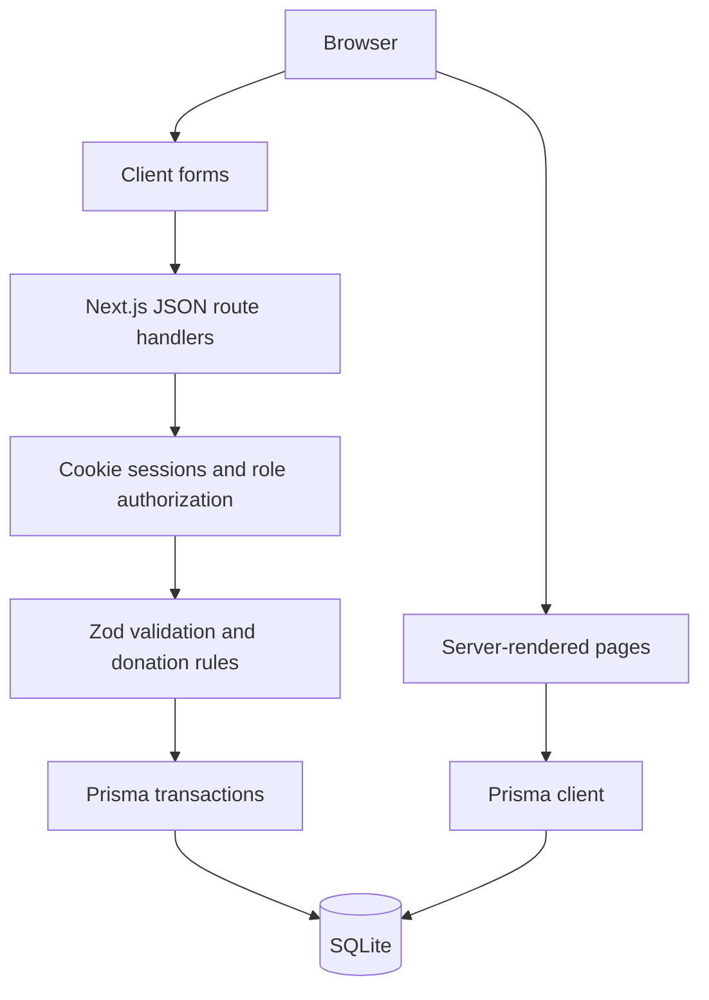

# Architecture

Donation Portal uses the Next.js App Router with TypeScript. Server components read Prisma records and render public pages and protected workspaces. Client components are limited to validated form submissions, status actions, and the interactive compatibility tool. Styles and original vector illustrations form a consistent responsive UI.

## Boundaries

- `src/app`: pages, workspace routes, layouts, loading/error states, and API handlers.
- `src/components`: shared cards, badges, stats, forms, and buttons.
- `src/lib/auth.ts`: password hashing, session creation/resolution, and page access checks.
- `src/lib/domain.ts`: red-cell compatibility, donor screening, confirmed-unit aggregation.
- `src/lib/validation.ts`: shared input constraints.
- `src/services/donations.ts`: transactional pledge and confirmation business logic.
- `src/lib/db.ts`: development-safe Prisma singleton.
- `prisma`: schema, tracked initial migration, and idempotent demo seed.
- `tests`: domain validation and isolated browser/API workflows.

## State and consistency

Campaign progress is derived from completed donations instead of a separately mutable amount-raised column. Pledge creation checks campaign status, closing date, compatibility, donor screening, one pending appointment per donor, and capacity inside a transaction. Confirmation verifies permissions, screening, and a pending-state compare-and-update, then updates the donor's last donation and completes a fully satisfied campaign in the same transaction. Repeated confirmation is rejected.

Institutional approval and campaign approval are separate processes. Editing an active campaign returns it to pending review (administrator edits retain the existing status). Cancelling a campaign cancels its pending appointments. Disabling a managed account revokes sessions and cancels relevant active campaigns and pending appointments.

## Authentication and security

Passwords use Node's scrypt with random salts. Session cookies contain random 256-bit tokens; only SHA-256 token hashes are stored in the database. Cookies are HttpOnly, SameSite=Lax, path-scoped, expire in seven days, and Secure in production. Mutations require an exact `Origin` match with `APP_URL`. Registration/login/pledge/request creation have database-backed rate limits. Admin roles cannot be registered publicly. User-controlled data is rendered as escaped React text and queries use Prisma parameterization.

## Deployment boundaries

This is a local demonstration, with no payment processor, real hospital integration, email provider, or clinical eligibility service. SQLite supports straightforward setup and small deployments, but should be replaced with PostgreSQL for concurrent production use. Such a migration needs a new provider-specific migration, migrated data, transaction/concurrency testing, backups, HTTPS, and operational controls.

The Google Fonts stylesheet is optional; system fonts remain available if offline. Illustrations are original local SVG files and all product workflows run without external image services.
