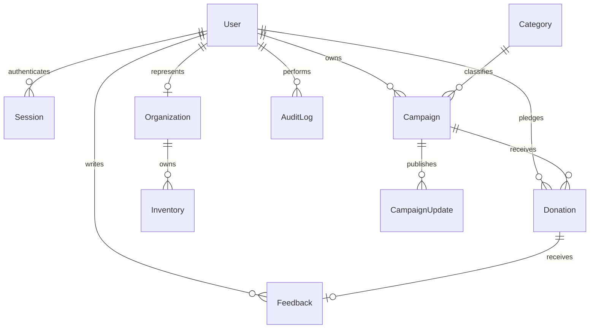

# Database design

Prisma manages a normalized SQLite schema. CUID primary keys, unique constraints, relation foreign keys, timestamps, and discovery/access indexes are declared in `prisma/schema.prisma` and tracked SQL migrations.

| Entity         | Purpose and constraints                                                                              |
| -------------- | ---------------------------------------------------------------------------------------------------- |
| User           | Unique email and phone; role/approval enums; active flag; donor screening fields                     |
| Session        | Unique hashed token; expiry index; deleted with user                                                 |
| Organization   | One per institutional user; unique license; owned inventory                                          |
| Category       | Unique name; referenced campaign categories cannot be deleted                                        |
| Campaign       | Blood group, requested units, urgency, dates, owner and category; indexed discovery and owner access |
| Donation       | Unique reference, donor, campaign, one-unit appointment, state and completion timestamp              |
| CampaignUpdate | Timestamped care team announcements                                                                  |
| Inventory      | Unique batch reference; blood group, available units, expiry, organization                           |
| Feedback       | Integer rating and comment; unique donation relation prevents duplicates                             |
| AuditLog       | Actor, action, entity reference and timestamp; actor can be set null if removed                      |
| RateLimit      | Counter/reset time keyed by account or request context                                               |
| Setting        | Configurable portal donation interval                                                                |

Completed donation quantities determine campaign progress. Pending appointments reserve capacity without increasing confirmed totals. Failed and cancelled records remain in history. Inventory issuance uses a guarded decrement that rejects expired or insufficient stock.

Donations restrict deletion of their donor or campaign; account access uses deactivation instead. Organization inventory and user sessions use cascade deletion. Feedback/update relations cascade with their owning records.

The seed skips an already populated user table to avoid overwriting local work. Its records are explicitly illustrative. Do not run local demo seeds against production databases.

Changing `provider` to PostgreSQL also requires a PostgreSQL `DATABASE_URL`, Prisma client regeneration, new PostgreSQL migrations, data transfer, and rerunning the lifecycle/concurrency tests. SQLite SQL is not portable migration output.
